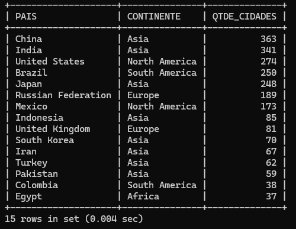
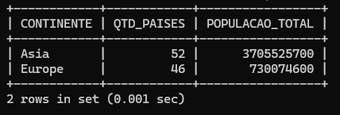
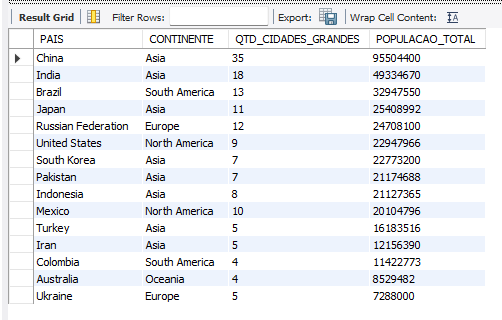
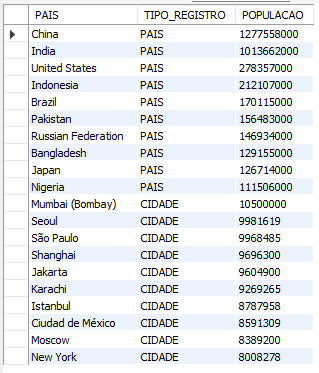
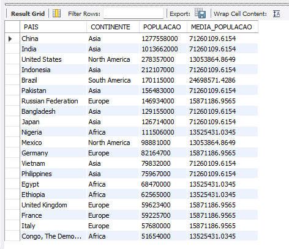
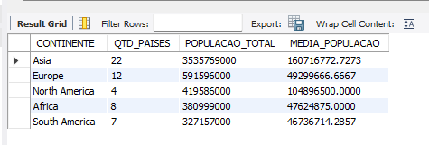
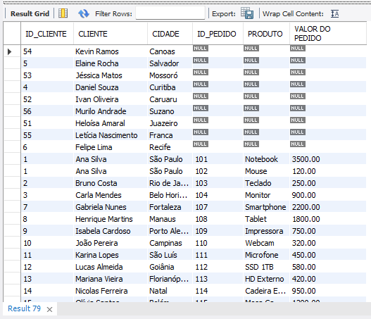
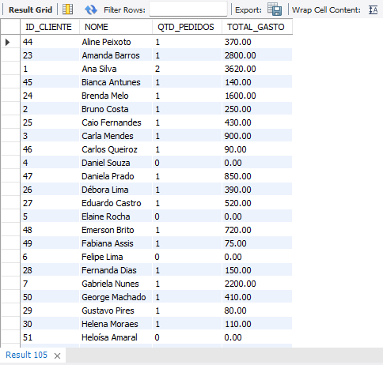

# Estudos SQL

Repositório dedicado aos meus estudos práticos em SQL avançado utilizando MySQL.

## Conteúdos estudados

* INNER JOIN
* LEFT JOIN
* RIGHT JOIN
* UNION
* Subqueries
* EXISTS
* CTE (Common Table Expressions)
* Window Functions
* Views
* Procedures
* Triggers
* Case When

## Base de dados utilizada

* World Database (base de exemplo oficial do MySQL).

##

# INNER JOIN

## Objetivo 1

Listar o nome do país e a quantidade de cidades cadastradas,
considerando apenas países com mais de 50 cidades.

---

<table>
<tr>
<td valign="top">

### Resultado


</td>

<td valign="top">

### [Query](inner-join/exercicio-01/query.sql)

```sql id="h2mf8x"
SELECT
    C.NAME AS PAÍS,
    COUNT(*) AS QUANTIDADE_CIDADES_CADASTRADAS
FROM CITY CI
INNER JOIN COUNTRY C
    ON CI.COUNTRYCODE = C.CODE
GROUP BY C.NAME
HAVING COUNT(*) > 50
ORDER BY QUANTIDADE_CIDADES_CADASTRADAS DESC;
```

</td>
</tr>
</table>

---

## Objetivo 2

Listar:

* nome do país
* quantidade de cidades cadastradas
* média da população das cidades

Considerando apenas cidades com população maior que 300000.

Exibir apenas países com mais de 20 cidades cadastradas.

---

<table>
<tr>
<td valign="top">

### Resultado


</td>

<td valign="top">

### [Query](inner-join/exercicio-02/query.sql)

```sql id="m7xq2n"
SELECT
    C.NAME AS PAÍS,
    COUNT(*) AS QTD_CIDADES,
    AVG(CI.POPULATION) AS MEDIA_POPULACAO
FROM CITY CI
INNER JOIN COUNTRY C
    ON CI.COUNTRYCODE = C.CODE
WHERE CI.POPULATION > 300000
GROUP BY C.NAME
HAVING COUNT(*) > 20
ORDER BY MEDIA_POPULACAO DESC;
```

</td>
</tr>
</table>

---

## Objetivo 3

Listar:

* continente
* quantidade de países distintos
* soma da população das cidades

Considerando apenas cidades:

* com nome iniciado pela letra `S`
* e população maior que 200000.

Exibir apenas continentes com soma da população das cidades maior que 50000000.

---

<table>
<tr>
<td valign="top">

### Resultado


</td>

<td valign="top">

### [Query](inner-join/exercicio-03/query.sql)

```sql id="q8v3mn"
SELECT
    C.CONTINENT AS CONTINENTE,
    COUNT(DISTINCT(C.NAME)) AS QTD_PAISES,
    SUM(CI.POPULATION) AS POPULACAO_TOTAL
FROM COUNTRY C
INNER JOIN CITY CI
    ON C.CODE = CI.COUNTRYCODE
WHERE CI.NAME LIKE 'S%'
    AND CI.POPULATION > 200000
GROUP BY C.CONTINENT
HAVING SUM(CI.POPULATION) > 50000000
ORDER BY POPULACAO_TOTAL DESC;
```

</td>
</tr>
</table>

---

# SUBQUERY

## Objetivo 1

Listar:

* nome do país
* população do país

Exibir apenas países com população maior que a média da população de todos os países.

Retornar apenas os 10 primeiros países nessas condições.

---

<table>
<tr>
<td valign="top">

### Resultado


</td>

<td valign="top">

### [Query](subqueries/exercicio-01/query.sql)

```sql id="z9qm2x"
SELECT
    NAME AS PAÍS,
    POPULATION AS POPULACAO
FROM COUNTRY
WHERE POPULATION > (
    SELECT
        AVG(POPULATION)
    FROM COUNTRY
)
ORDER BY POPULACAO DESC
LIMIT 10;
```

</td>
</tr>
</table>

---

## Objetivo 2

Listar:

* nome da cidade
* população da cidade
* nome do país

Exibir apenas cidades com população maior que a média da população de todas as cidades.

Retornar apenas cidades pertencentes a países do continente `Asia`.

Limitar o resultado aos 10 registros com maior população.

---

<table>
<tr>
<td valign="top">

### Resultado


</td>

<td valign="top">

### [Query](subqueries/exercicio-02/query.sql)

```sql id="n4pk8x"
SELECT
    CI.NAME AS CIDADE,
    CI.POPULATION AS POPULACAO,
    C.NAME AS PAIS,
    C.CONTINENT AS CONTINENTE
FROM CITY CI
INNER JOIN COUNTRY C
    ON CI.COUNTRYCODE = C.CODE
WHERE CI.POPULATION > (
    SELECT
        AVG(POPULATION)
    FROM CITY
)
AND C.CONTINENT = 'ASIA'
ORDER BY POPULACAO DESC
LIMIT 10;
```

</td>
</tr>
</table>

---

## Objetivo 3

Listar:

* nome do país
* continente
* população do país

Exibir apenas países que:

* possuem cidades com população maior que 8000000
* e possuem a letra `A` em qualquer posição do nome.

Retornar apenas os 10 países com maior população.

---

<table>
<tr>
<td valign="top">

### Resultado


</td>

<td valign="top">

### [Query](subqueries/exercicio-03/query.sql)

```sql id="k8vn4p"
SELECT
    NAME AS PAIS,
    CONTINENT AS CONTINENTE,
    POPULATION AS POPULACAO
FROM COUNTRY
WHERE CODE IN (
    SELECT
        COUNTRYCODE
    FROM CITY
    WHERE POPULATION > 8000000
)
AND NAME LIKE '%A%'
ORDER BY POPULACAO DESC
LIMIT 10;
```

</td>
</tr>
</table>

---

# PROCEDURE

## Objetivo 1

Criar uma procedure chamada `LISTAR_PAISES_POR_CONTINENTE`.

A procedure deve receber um parâmetro contendo o nome do continente.

Listar:

* nome do país
* continente
* população

Ordenar da maior população para a menor.

Obs: Como boa prática, antes e após a criação da procedure, realizo a alteração do `DELIMITER`.

---

<table>
<tr>
<td valign="top">

### Resultado


</td>

<td valign="top">

### [Query](procedures/exercicio-01/query.sql)

```sql id="f8mk2q"
DELIMITER #

CREATE PROCEDURE LISTAR_PAISES_POR_CONTINENTE(IN P_CONTINENTE VARCHAR(30))
BEGIN

    SELECT
        NAME AS PAIS,
        CONTINENT AS CONTINENTE,
        POPULATION AS POPULACAO
    FROM COUNTRY
    WHERE CONTINENT = P_CONTINENTE
    ORDER BY POPULACAO DESC;

END #

DELIMITER ;

CALL LISTAR_PAISES_POR_CONTINENTE('SOUTH AMERICA');
```

</td>
</tr>
</table>

---

## Objetivo 2

Criar uma procedure chamada `LISTAR_CIDADES_POR_POPULACAO`.

A procedure deve receber um parâmetro contendo um valor de população mínima.

Listar:

* nome da cidade
* população da cidade
* nome do país

Exibir apenas cidades com população maior que o valor informado no parâmetro.

Retornar apenas os 10 registros com maior população.

---

<table>
<tr>
<td valign="top">

### Resultado


</td>

<td valign="top">

### [Query](procedures/exercicio-02/query.sql)

```sql id="r4xn9m"
DELIMITER #

CREATE PROCEDURE LISTAR_CIDADES_POR_POPULACAO(IN P_POPULACAO INT)
BEGIN

    SELECT
        CI.NAME AS CIDADE,
        CI.POPULATION AS POPULACAO,
        C.NAME AS PAIS
    FROM CITY CI
    INNER JOIN COUNTRY C
        ON CI.COUNTRYCODE = C.CODE
    WHERE CI.POPULATION > P_POPULACAO
    ORDER BY POPULACAO DESC
    LIMIT 10;

END #

DELIMITER ;

CALL LISTAR_CIDADES_POR_POPULACAO(50000);
```

</td>
</tr>
</table>

---

## Objetivo 3

Criar uma procedure chamada `LISTAR_CIDADES_POR_PAIS`.

A procedure deve receber um parâmetro contendo o nome de um país.

Listar:

* nome da cidade
* população da cidade
* nome do país
* continente

Exibir apenas cidades pertencentes ao país informado no parâmetro.

Retornar apenas as 15 cidades com maior população.

---

<table>
<tr>
<td valign="top">

### Resultado


</td>

<td valign="top">

### [Query](procedures/exercicio-03/query.sql)

```sql id="p6mk8v"
DELIMITER #

CREATE PROCEDURE LISTAR_CIDADES_POR_PAIS(IN P_PAIS VARCHAR(60))
BEGIN

    SELECT
        CI.NAME AS CIDADE,
        CI.POPULATION AS POPULACAO,
        C.NAME AS PAIS,
        C.CONTINENT AS CONTINENTE
    FROM CITY CI
    INNER JOIN COUNTRY C
        ON CI.COUNTRYCODE = C.CODE
    WHERE C.NAME = P_PAIS
    ORDER BY POPULACAO DESC
    LIMIT 15;

END #

DELIMITER ;

CALL LISTAR_CIDADES_POR_PAIS('BRAZIL');
```

</td>
</tr>
</table>

---

# CASE WHEN

## Objetivo 1

Listar:

* nome do país
* continente
* população
* classificação da população

Classificar a população dos países utilizando `CASE WHEN`, considerando:

* população maior que 100000000 → `POPULAÇÃO MUITO ALTA`
* população entre 50000000 e 100000000 → `POPULAÇÃO ALTA`
* população entre 10000000 e 50000000 → `POPULAÇÃO MÉDIA`
* população menor que 10000000 → `POPULAÇÃO BAIXA`

Considerar apenas países:

* do continente `Asia`
* com população maior que 1000000

Retornar apenas 15 registros.

---

<table>
<tr>
<td valign="top">

### Resultado


</td>

<td valign="top">

### [Query](case-when/exercicio-01/query.sql)

```sql
SELECT
    NAME AS PAIS,
    CONTINENT AS CONTINENTE,
    POPULATION AS 'POPULAÇÃO',
    CASE
        WHEN POPULATION > 100000000
        THEN 'POPULAÇÃO MUITO ALTA'

        WHEN POPULATION BETWEEN 50000000 AND 100000000
        THEN 'POPULAÇÃO ALTA'

        WHEN POPULATION BETWEEN 10000000 AND 50000000
        THEN 'POPULAÇÃO MÉDIA'

        ELSE 'POPULAÇÃO BAIXA'
    END AS CLASSIFICACAO_POPULACAO
FROM COUNTRY
WHERE CONTINENT = 'ASIA'
    AND POPULATION > 1000000
LIMIT 15;
```

</td>
</tr>
</table>

---

## Objetivo 2

Listar:

* nome da cidade
* nome do país
* continente
* população da cidade
* classificação do porte da cidade

Classificar o porte das cidades utilizando `CASE WHEN`, considerando:

* população maior que 5000000 → `MEGACIDADE`
* população entre 1000000 e 5000000 → `CIDADE GRANDE`
* população entre 500000 e 999999 → `CIDADE MÉDIA`
* população menor que 500000 → `CIDADE PEQUENA`

Considerar apenas cidades:

* pertencentes ao continente `Europe`
* com população maior que 100000

Ordenar da maior população para a menor.

Retornar apenas 20 registros.

---

<table>
<tr>
<td valign="top">

### Resultado


</td>

<td valign="top">

### [Query](case-when/exercicio-02/query.sql)

```sql
SELECT
    CI.NAME AS CIDADE,
    C.NAME AS PAIS,
    C.CONTINENT AS CONTINENTE,
    CI.POPULATION AS POPULACAO,
    CASE
        WHEN CI.POPULATION > 5000000
        THEN 'MEGACIDADE'

        WHEN CI.POPULATION >= 1000000
            AND CI.POPULATION <= 5000000
        THEN 'CIDADE GRANDE'

        WHEN CI.POPULATION >= 500000
            AND CI.POPULATION < 1000000
        THEN 'CIDADE MÉDIA'

        ELSE 'CIDADE PEQUENA'
    END AS CLASSIFICACAO_CIDADE
FROM CITY CI
INNER JOIN COUNTRY C
    ON CI.COUNTRYCODE = C.CODE
WHERE C.CONTINENT = 'EUROPE'
    AND CI.POPULATION > 100000
ORDER BY POPULACAO DESC
LIMIT 20;
```

</td>
</tr>
</table>

---

## Objetivo 3

Listar:

* continente
* quantidade de países distintos
* população total das cidades
* classificação do impacto urbano

Classificar o impacto urbano utilizando `CASE WHEN`, considerando:

* soma da população das cidades maior que 1000000000 → `IMPACTO URBANO MUITO ALTO`
* soma da população das cidades entre 500000000 e 1000000000 → `IMPACTO URBANO ALTO`
* soma da população das cidades entre 100000000 e 500000000 → `IMPACTO URBANO MÉDIO`
* soma da população das cidades menor que 100000000 → `IMPACTO URBANO BAIXO`

Considerar apenas cidades com população maior que 300000.

Agrupar os resultados por continente.

Ordenar da maior população total das cidades para a menor.

---

<table>
<tr>
<td valign="top">

### Resultado


</td>

<td valign="top">

### [Query](case-when/exercicio-03/query.sql)

```sql
SELECT
    C.CONTINENT AS CONTINENTE,
    COUNT(DISTINCT C.CODE) AS QTD_PAISES,
    SUM(CI.POPULATION) AS POPULACAO_TOTAL,
    CASE
        WHEN SUM(CI.POPULATION) > 1000000000
        THEN 'IMPACTO URBANO MUITO ALTO'

        WHEN SUM(CI.POPULATION) >= 500000000
            AND SUM(CI.POPULATION) <= 1000000000
        THEN 'IMPACTO URBANO ALTO'

        WHEN SUM(CI.POPULATION) >= 100000000
            AND SUM(CI.POPULATION) < 500000000
        THEN 'IMPACTO URBANO MÉDIO'

        ELSE 'IMPACTO URBANO BAIXO'
    END AS CLASSIFICACAO_IMPACTO_URBANO
FROM COUNTRY C
INNER JOIN CITY CI
    ON C.CODE = CI.COUNTRYCODE
WHERE CI.POPULATION > 300000
GROUP BY C.CONTINENT
ORDER BY POPULACAO_TOTAL DESC;
```

</td>
</tr>
</table>

---

# EXISTS

## Objetivo 1

Listar:

* nome do país
* continente
* população do país

Exibir apenas países que possuem pelo menos uma cidade cadastrada com população maior que 8000000.

Retornar apenas os 10 países com maior população.

---

<table>
<tr>
<td valign="top">

### Resultado


</td>

<td valign="top">

### [Query](exists/exercicio-01/query.sql)

```sql
SELECT
    C.NAME AS PAIS,
    C.CONTINENT AS CONTINENTE,
    C.POPULATION AS POPULACAO
FROM COUNTRY C
WHERE EXISTS (
    SELECT 1
    FROM CITY CI
    WHERE C.CODE = CI.COUNTRYCODE
        AND CI.POPULATION > 8000000
)
ORDER BY POPULACAO DESC
LIMIT 10;
```

</td>
</tr>
</table>

---

## Objetivo 2

Listar:

* nome do país
* continente
* quantidade total de cidades cadastradas

Exibir apenas países que possuem pelo menos uma cidade com população maior que 5000000.

Mostrar apenas países que tenham mais de 20 cidades cadastradas no total.

Retornar apenas os 15 países com maior quantidade de cidades.

---

<table>
<tr>
<td valign="top">

### Resultado



</td>

<td valign="top">

### [Query](exists/exercicio-02/query.sql)

```sql
SELECT
    C.NAME AS PAIS,
    C.CONTINENT AS CONTINENTE,
    COUNT(CI.ID) AS QTDE_CIDADES
FROM COUNTRY C
JOIN CITY CI
    ON C.CODE = CI.COUNTRYCODE
WHERE EXISTS (
    SELECT 1
    FROM CITY CI2
    WHERE CI2.COUNTRYCODE = C.CODE
        AND CI2.POPULATION > 5000000
)
GROUP BY C.CODE, C.NAME, C.CONTINENT
HAVING COUNT(CI.ID) > 20
ORDER BY QTDE_CIDADES DESC
LIMIT 15;
```

</td>
</tr>
</table>

---

## Objetivo 3

Listar:

* nome do continente
* quantidade de países
* população total dos países

Exibir apenas continentes que possuem pelo menos um país com expectativa de vida maior que 80.

Mostrar apenas continentes com mais de 10 países cadastrados.

Ordenar os continentes pela maior população total.

---

<table>
<tr>
<td valign="top">

### Resultado



</td>

<td valign="top">

### [Query](exists/exercicio-03/query.sql)

```sql
SELECT
    C1.CONTINENT AS CONTINENTE,
    COUNT(C1.CODE) AS QTD_PAISES,
    SUM(C1.POPULATION) AS POPULACAO_TOTAL
FROM COUNTRY C1
WHERE EXISTS (
    SELECT 1
    FROM COUNTRY C2
    WHERE C2.LIFEEXPECTANCY > 80
        AND C2.CONTINENT = C1.CONTINENT
)
GROUP BY C1.CONTINENT
HAVING COUNT(C1.CODE) > 10
ORDER BY POPULACAO_TOTAL DESC;
```

</td>
</tr>
</table>

---

# CTE

## Objetivo 1

Criar uma CTE chamada `CIDADES_GRANDES`.

A CTE deve listar cidades com população maior que 1000000.

Na query principal, listar:

* nome do país
* continente
* quantidade de cidades grandes
* população total dessas cidades grandes

Exibir apenas países com mais de 3 cidades grandes.

Retornar apenas os 15 países com maior população total dessas cidades.

---

<table>
<tr>
<td valign="top">

### Resultado



</td>

<td valign="top">

### [Query](cte/exercicio-01/query.sql)

```sql
WITH CIDADES_GRANDES AS (
    SELECT
        COUNTRYCODE,
        NAME,
        POPULATION
    FROM CITY
    WHERE POPULATION > 1000000
)
SELECT
    C.NAME AS PAIS,
    C.CONTINENT AS CONTINENTE,
    COUNT(*) AS QTD_CIDADES_GRANDES,
    SUM(CG.POPULATION) AS POPULACAO_TOTAL
FROM CIDADES_GRANDES CG
INNER JOIN COUNTRY C
    ON CG.COUNTRYCODE = C.CODE
GROUP BY C.CODE, C.NAME, C.CONTINENT
HAVING COUNT(*) > 3
ORDER BY POPULACAO_TOTAL DESC
LIMIT 15;
```

</td>
</tr>
</table>

---

## Objetivo 2

Criar uma CTE chamada `MEDIA_POPULACAO_CONTINENTE`.

A CTE deve calcular a média da população dos países por continente.

Na query principal, listar:

* nome do país
* continente
* população do país
* média de população do continente

Exibir apenas países cuja população seja maior que a média de população do seu próprio continente.

Retornar apenas os 20 países com maior população.

---

<table>
<tr>
<td valign="top">

### Resultado


</td>

<td valign="top">

### [Query](cte/exercicio-02/query.sql)

```sql
WITH MEDIA_POPULACAO_CONTINENTE AS (
    SELECT
        AVG(POPULATION) AS MEDIA_POPULACAO,
        CONTINENT AS CONTINENTE
    FROM COUNTRY
    GROUP BY CONTINENT
)
SELECT
    C.NAME AS PAIS,
    C.CONTINENT AS CONTINENTE,
    C.POPULATION AS POPULACAO,
    MPC.MEDIA_POPULACAO AS MEDIA_POPULACAO
FROM COUNTRY C
INNER JOIN MEDIA_POPULACAO_CONTINENTE MPC
    ON C.CONTINENT = MPC.CONTINENTE
WHERE C.POPULATION > MPC.MEDIA_POPULACAO
ORDER BY C.POPULATION DESC
LIMIT 20;
```

</td>
</tr>
</table>

---

## Objetivo 3

Criar uma CTE chamada `PAISES_COM_MUITAS_CIDADES`.

A CTE deve listar países que possuem mais de 10 cidades cadastradas.

Na query principal, listar:

* nome do continente
* quantidade de países com mais de 10 cidades
* soma da população desses países
* média da população desses países

Exibir apenas continentes com mais de 2 países nessa condição.

Ordenar pela maior soma de população para a menor.

---

<table>
<tr>
<td valign="top">

### Resultado


</td>

<td valign="top">

### [Query](cte/exercicio-03/query.sql)

```sql
WITH PAISES_COM_MUITAS_CIDADES AS (
    SELECT
        COUNTRYCODE,
        COUNT(*) AS QTD_CIDADES
    FROM CITY
    GROUP BY COUNTRYCODE
    HAVING COUNT(*) > 10
)
SELECT
    C.CONTINENT AS CONTINENTE,
    COUNT(*) AS QTD_PAISES,
    SUM(C.POPULATION) AS POPULACAO_TOTAL,
    AVG(C.POPULATION) AS MEDIA_POPULACAO
FROM PAISES_COM_MUITAS_CIDADES PCMC
INNER JOIN COUNTRY C
    ON PCMC.COUNTRYCODE = C.CODE
GROUP BY C.CONTINENT
HAVING COUNT(*) > 2
ORDER BY POPULACAO_TOTAL DESC;
```

</td>
</tr>
</table>

---

# UNION

## Objetivo 1

Listar:

* nome
* tipo do registro
* população

Unir em uma única consulta:

* países com população maior que 100000000
* cidades com população maior que 8000000

Criar uma coluna chamada `TIPO_REGISTRO`, indicando:

* `PAIS` para registros vindos da tabela `COUNTRY`
* `CIDADE` para registros vindos da tabela `CITY`

Ordenar os registros da maior população para a menor.

---

<table>
<tr>
<td valign="top">

### Resultado



</td>

<td valign="top">

### [Query](union/exercicio-01/query.sql)

```sql
SELECT
    NAME AS PAIS,
    'PAIS' AS TIPO_REGISTRO,
    POPULATION AS POPULACAO
FROM COUNTRY
WHERE POPULATION > 100000000

UNION

SELECT
    NAME AS CIDADE,
    'CIDADE' AS TIPO_REGISTRO,
    POPULATION AS POPULACAO
FROM CITY
WHERE POPULATION > 8000000
ORDER BY POPULACAO DESC;
```

</td>
</tr>
</table>

---

## Objetivo 2

Listar:

* nome do país
* nome da cidade
* população
* tipo do registro

Unir em uma única consulta:

* cidades com população maior que 7000000
* capitais de países com população maior que 50000000

Criar uma coluna chamada `TIPO_REGISTRO`, indicando:

* `CIDADE GRANDE`
* `CAPITAL DE PAIS POPULOSO`

Ordenar os registros da maior população para a menor.

---

<table>
<tr>
<td valign="top">

### Resultado



</td>

<td valign="top">

### [Query](union/exercicio-02/query.sql)

```sql
SELECT
    C.NAME AS PAIS,
    CI.NAME AS CIDADE,
    CI.POPULATION AS POPULACAO,
    'CIDADE GRANDE' AS TIPO_REGISTRO
FROM CITY CI
JOIN COUNTRY C
    ON CI.COUNTRYCODE = C.CODE
WHERE CI.POPULATION > 7000000

UNION

SELECT
    C.NAME AS PAIS,
    CI.NAME AS CIDADE,
    CI.POPULATION AS POPULACAO,
    'CAPITAL DE PAIS POPULOSO' AS TIPO_REGISTRO
FROM COUNTRY C
JOIN CITY CI
    ON C.CAPITAL = CI.ID
WHERE C.POPULATION > 50000000
ORDER BY POPULACAO DESC;
```

</td>
</tr>
</table>

---

## Objetivo 3

Listar:

* nome do país
* continente
* população
* categoria do registro

Unir em uma única consulta:

* países da `Asia` com população maior que 50000000
* países da `Europe` com população maior que 30000000
* países da `South America` com população maior que 20000000

Criar uma coluna chamada `CATEGORIA_REGISTRO`, indicando:

* `PAIS ASIATICO POPULOSO`
* `PAIS EUROPEU POPULOSO`
* `PAIS SUL-AMERICANO POPULOSO`

Ordenar os registros da maior população para a menor.

---

<table>
<tr>
<td valign="top">

### Resultado



</td>

<td valign="top">

### [Query](union/exercicio-03/query.sql)

```sql
SELECT
    NAME AS PAIS,
    CONTINENT AS CONTINENTE,
    POPULATION AS POPULACAO,
    'PAIS ASIATICO POPULOSO' AS CATEGORIA_REGISTRO
FROM COUNTRY
WHERE CONTINENT = 'ASIA'
    AND POPULATION > 50000000

UNION

SELECT
    NAME AS PAIS,
    CONTINENT AS CONTINENTE,
    POPULATION AS POPULACAO,
    'PAIS EUROPEU POPULOSO' AS CATEGORIA_REGISTRO
FROM COUNTRY
WHERE CONTINENT = 'EUROPE'
    AND POPULATION > 30000000

UNION

SELECT
    NAME AS PAIS,
    CONTINENT AS CONTINENTE,
    POPULATION AS POPULACAO,
    'PAIS SUL-AMERICANO POPULOSO' AS CATEGORIA_REGISTRO
FROM COUNTRY
WHERE CONTINENT = 'SOUTH AMERICA'
    AND POPULATION > 20000000
ORDER BY POPULACAO DESC;
```

</td>
</tr>
</table>

---

# LEFT JOIN

Para praticar `LEFT JOIN` e `RIGHT JOIN` de forma mais visual, criei um database simples com duas tabelas principais: `clientes` e `pedidos`.

Essa base foi criada propositalmente sem `FOREIGN KEY`, permitindo registros sem correspondência entre as tabelas. Dessa forma, é possível visualizar melhor situações como:

* clientes que ainda não possuem pedidos
* pedidos que não possuem cliente correspondente

---

## Objetivo 1

Listar:

* id do cliente
* nome do cliente
* cidade do cliente
* id do pedido
* produto
* valor do pedido

Exibir todos os clientes, mesmo aqueles que ainda não possuem pedidos.

Clientes sem pedidos devem aparecer com os dados do pedido como `NULL`.

A ordenação foi feita pelo id do pedido para facilitar a visualização dos registros sem pedido no resultado.

---

<table>
<tr>
<td valign="top">

### Resultado



</td>

<td valign="top">

### [Query](left-join/exercicio-01/query.sql)

```sql
SELECT
    C.ID_CLIENTE,
    C.NOME AS CLIENTE,
    C.CIDADE,
    P.ID_PEDIDO,
    P.PRODUTO,
    P.VALOR AS 'VALOR DO PEDIDO'
FROM CLIENTES C
LEFT JOIN PEDIDOS P
    ON C.ID_CLIENTE = P.ID_CLIENTE
ORDER BY P.ID_PEDIDO;
```

</td>
</tr>
</table>

---

## Objetivo 2

Listar:

* id do cliente
* nome do cliente
* quantidade de pedidos realizados
* valor total gasto

Exibir todos os clientes, inclusive aqueles que não fizeram nenhum pedido.

Clientes sem pedidos devem aparecer com:

* quantidade de pedidos igual a `0`
* total gasto igual a `0`

Para substituir valores `NULL` no total gasto, foi utilizada a função `COALESCE()`.

A ordenação foi feita pelo nome do cliente para facilitar a visualização do resultado.

---

<table>
<tr>
<td valign="top">

### Resultado



</td>

<td valign="top">

### [Query](left-join/exercicio-02/query.sql)

```sql
SELECT
    C.ID_CLIENTE,
    C.NOME,
    COUNT(P.ID_PEDIDO) AS QTD_PEDIDOS,
    COALESCE(SUM(P.VALOR), 0) AS TOTAL_GASTO
FROM CLIENTES C
LEFT JOIN PEDIDOS P
    ON C.ID_CLIENTE = P.ID_CLIENTE
GROUP BY C.ID_CLIENTE, C.NOME
ORDER BY C.NOME;
```

</td>
</tr>
</table>

---
