# Estudos SQL

Repositório dedicado aos meus estudos práticos em SQL avançado utilizando MySQL.

## Conteúdos estudados

* INNER JOIN
* LEFT JOIN
* RIGHT JOIN
* FULL JOIN
* Subqueries
* EXISTS
* CTE (Common Table Expressions)
* Window Functions
* Views
* Procedures
* Triggers
* Case When

## Base de dados utilizada

* World Database (base de exemplo oficial do MySQL).

##

# INNER JOIN

## Objetivo 1

Listar o nome do país e a quantidade de cidades cadastradas,
considerando apenas países com mais de 50 cidades.

---

<table>
<tr>
<td valign="top">

### Resultado

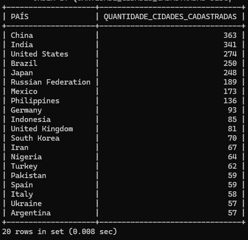

</td>

<td valign="top">

### [Query](inner-join/exercicio-01/query.sql)

```sql id="h2mf8x"
SELECT
    C.NAME AS PAÍS,
    COUNT(*) AS QUANTIDADE_CIDADES_CADASTRADAS
FROM CITY CI
INNER JOIN COUNTRY C
    ON CI.COUNTRYCODE = C.CODE
GROUP BY C.NAME
HAVING COUNT(*) > 50
ORDER BY QUANTIDADE_CIDADES_CADASTRADAS DESC;
```

</td>
</tr>
</table>

---

## Objetivo 2

Listar:

* nome do país
* quantidade de cidades cadastradas
* média da população das cidades

Considerando apenas cidades com população maior que 300000.

Exibir apenas países com mais de 20 cidades cadastradas.

---

<table>
<tr>
<td valign="top">

### Resultado

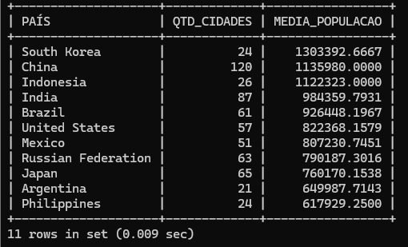

</td>

<td valign="top">

### [Query](inner-join/exercicio-02/query.sql)

```sql id="m7xq2n"
SELECT
    C.NAME AS PAÍS,
    COUNT(*) AS QTD_CIDADES,
    AVG(CI.POPULATION) AS MEDIA_POPULACAO
FROM CITY CI
INNER JOIN COUNTRY C
    ON CI.COUNTRYCODE = C.CODE
WHERE CI.POPULATION > 300000
GROUP BY C.NAME
HAVING COUNT(*) > 20
ORDER BY MEDIA_POPULACAO DESC;
```

</td>
</tr>
</table>

---

## Objetivo 3

Listar:

* continente
* quantidade de países distintos
* soma da população das cidades

Considerando apenas cidades:

* com nome iniciado pela letra `S`
* e população maior que 200000.

Exibir apenas continentes com soma da população das cidades maior que 50000000.

---

<table>
<tr>
<td valign="top">

### Resultado

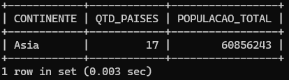

</td>

<td valign="top">

### [Query](inner-join/exercicio-03/query.sql)

```sql id="q8v3mn"
SELECT
    C.CONTINENT AS CONTINENTE,
    COUNT(DISTINCT(C.NAME)) AS QTD_PAISES,
    SUM(CI.POPULATION) AS POPULACAO_TOTAL
FROM COUNTRY C
INNER JOIN CITY CI
    ON C.CODE = CI.COUNTRYCODE
WHERE CI.NAME LIKE 'S%'
    AND CI.POPULATION > 200000
GROUP BY C.CONTINENT
HAVING SUM(CI.POPULATION) > 50000000
ORDER BY POPULACAO_TOTAL DESC;
```

</td>
</tr>
</table>

---

# SUBQUERY

## Objetivo 1

Listar:

* nome do país
* população do país

Exibir apenas países com população maior que a média da população de todos os países.

Retornar apenas os 10 primeiros países nessas condições.

---

<table>
<tr>
<td valign="top">

### Resultado

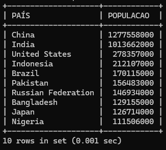

</td>

<td valign="top">

### [Query](subqueries/exercicio-01/query.sql)

```sql id="z9qm2x"
SELECT
    NAME AS PAÍS,
    POPULATION AS POPULACAO
FROM COUNTRY
WHERE POPULATION > (
    SELECT
        AVG(POPULATION)
    FROM COUNTRY
)
ORDER BY POPULACAO DESC
LIMIT 10;
```

</td>
</tr>
</table>

---

## Objetivo 2

Listar:

* nome da cidade
* população da cidade
* nome do país

Exibir apenas cidades com população maior que a média da população de todas as cidades.

Retornar apenas cidades pertencentes a países do continente `Asia`.

Limitar o resultado aos 10 registros com maior população.

---

<table>
<tr>
<td valign="top">

### Resultado

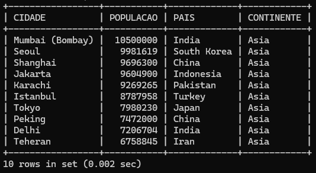

</td>

<td valign="top">

### [Query](subqueries/exercicio-02/query.sql)

```sql id="n4pk8x"
SELECT
    CI.NAME AS CIDADE,
    CI.POPULATION AS POPULACAO,
    C.NAME AS PAIS,
    C.CONTINENT AS CONTINENTE
FROM CITY CI
INNER JOIN COUNTRY C
    ON CI.COUNTRYCODE = C.CODE
WHERE CI.POPULATION > (
    SELECT
        AVG(POPULATION)
    FROM CITY
)
AND C.CONTINENT = 'ASIA'
ORDER BY POPULACAO DESC
LIMIT 10;
```

</td>
</tr>
</table>

---

## Objetivo 3

Listar:

* nome do país
* continente
* população do país

Exibir apenas países que:

* possuem cidades com população maior que 8000000
* e possuem a letra `A` em qualquer posição do nome.

Retornar apenas os 10 países com maior população.

---

<table>
<tr>
<td valign="top">

### Resultado

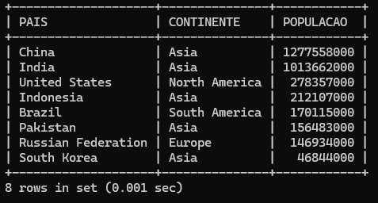

</td>

<td valign="top">

### [Query](subqueries/exercicio-03/query.sql)

```sql id="k8vn4p"
SELECT
    NAME AS PAIS,
    CONTINENT AS CONTINENTE,
    POPULATION AS POPULACAO
FROM COUNTRY
WHERE CODE IN (
    SELECT
        COUNTRYCODE
    FROM CITY
    WHERE POPULATION > 8000000
)
AND NAME LIKE '%A%'
ORDER BY POPULACAO DESC
LIMIT 10;
```

</td>
</tr>
</table>

---

# PROCEDURE

## Objetivo 1

Criar uma procedure chamada `LISTAR_PAISES_POR_CONTINENTE`.

A procedure deve receber um parâmetro contendo o nome do continente.

Listar:

* nome do país
* continente
* população

Ordenar da maior população para a menor.

Obs: Como boa prática, antes e após a criação da procedure, realizo a alteração do `DELIMITER`.

---

<table>
<tr>
<td valign="top">

### Resultado

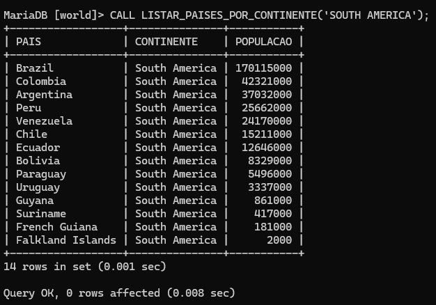

</td>

<td valign="top">

### [Query](procedures/exercicio-01/query.sql)

```sql id="f8mk2q"
DELIMITER #

CREATE PROCEDURE LISTAR_PAISES_POR_CONTINENTE(IN P_CONTINENTE VARCHAR(30))
BEGIN

    SELECT
        NAME AS PAIS,
        CONTINENT AS CONTINENTE,
        POPULATION AS POPULACAO
    FROM COUNTRY
    WHERE CONTINENT = P_CONTINENTE
    ORDER BY POPULACAO DESC;

END #

DELIMITER ;

CALL LISTAR_PAISES_POR_CONTINENTE('SOUTH AMERICA');
```

</td>
</tr>
</table>

---

## Objetivo 2

Criar uma procedure chamada `LISTAR_CIDADES_POR_POPULACAO`.

A procedure deve receber um parâmetro contendo um valor de população mínima.

Listar:

* nome da cidade
* população da cidade
* nome do país

Exibir apenas cidades com população maior que o valor informado no parâmetro.

Retornar apenas os 10 registros com maior população.

---

<table>
<tr>
<td valign="top">

### Resultado

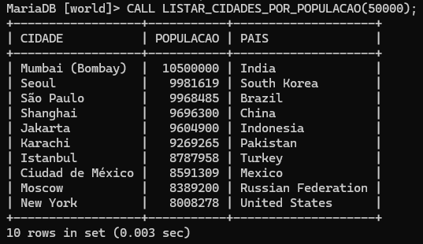

</td>

<td valign="top">

### [Query](procedures/exercicio-02/query.sql)

```sql id="r4xn9m"
DELIMITER #

CREATE PROCEDURE LISTAR_CIDADES_POR_POPULACAO(IN P_POPULACAO INT)
BEGIN

    SELECT
        CI.NAME AS CIDADE,
        CI.POPULATION AS POPULACAO,
        C.NAME AS PAIS
    FROM CITY CI
    INNER JOIN COUNTRY C
        ON CI.COUNTRYCODE = C.CODE
    WHERE CI.POPULATION > P_POPULACAO
    ORDER BY POPULACAO DESC
    LIMIT 10;

END #

DELIMITER ;

CALL LISTAR_CIDADES_POR_POPULACAO(50000);
```

</td>
</tr>
</table>

---

## Objetivo 3

Criar uma procedure chamada `LISTAR_CIDADES_POR_PAIS`.

A procedure deve receber um parâmetro contendo o nome de um país.

Listar:

* nome da cidade
* população da cidade
* nome do país
* continente

Exibir apenas cidades pertencentes ao país informado no parâmetro.

Retornar apenas as 15 cidades com maior população.

---

<table>
<tr>
<td valign="top">

### Resultado

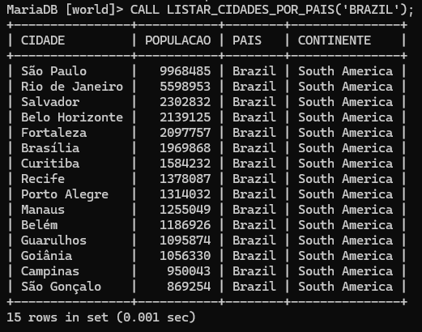

</td>

<td valign="top">

### [Query](procedures/exercicio-03/query.sql)

```sql id="p6mk8v"
DELIMITER #

CREATE PROCEDURE LISTAR_CIDADES_POR_PAIS(IN P_PAIS VARCHAR(60))
BEGIN

    SELECT
        CI.NAME AS CIDADE,
        CI.POPULATION AS POPULACAO,
        C.NAME AS PAIS,
        C.CONTINENT AS CONTINENTE
    FROM CITY CI
    INNER JOIN COUNTRY C
        ON CI.COUNTRYCODE = C.CODE
    WHERE C.NAME = P_PAIS
    ORDER BY POPULACAO DESC
    LIMIT 15;

END #

DELIMITER ;

CALL LISTAR_CIDADES_POR_PAIS('BRAZIL');
```

</td>
</tr>
</table>

---

# CASE WHEN

## Objetivo 1

Listar:

* nome do país
* continente
* população
* classificação da população

Classificar a população dos países utilizando `CASE WHEN`, considerando:

* população maior que 100000000 → `POPULAÇÃO MUITO ALTA`
* população entre 50000000 e 100000000 → `POPULAÇÃO ALTA`
* população entre 10000000 e 50000000 → `POPULAÇÃO MÉDIA`
* população menor que 10000000 → `POPULAÇÃO BAIXA`

Considerar apenas países:

* do continente `Asia`
* com população maior que 1000000

Retornar apenas 15 registros.

---

<table>
<tr>
<td valign="top">

### Resultado

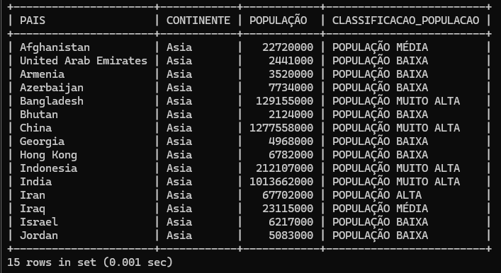

</td>

<td valign="top">

### [Query](case-when/exercicio-01/query.sql)

```sql
SELECT
    NAME AS PAIS,
    CONTINENT AS CONTINENTE,
    POPULATION AS 'POPULAÇÃO',
    CASE
        WHEN POPULATION > 100000000
        THEN 'POPULAÇÃO MUITO ALTA'

        WHEN POPULATION BETWEEN 50000000 AND 100000000
        THEN 'POPULAÇÃO ALTA'

        WHEN POPULATION BETWEEN 10000000 AND 50000000
        THEN 'POPULAÇÃO MÉDIA'

        ELSE 'POPULAÇÃO BAIXA'
    END AS CLASSIFICACAO_POPULACAO
FROM COUNTRY
WHERE CONTINENT = 'ASIA'
    AND POPULATION > 1000000
LIMIT 15;
```

</td>
</tr>
</table>

---

## Objetivo 2

Listar:

* nome da cidade
* nome do país
* continente
* população da cidade
* classificação do porte da cidade

Classificar o porte das cidades utilizando `CASE WHEN`, considerando:

* população maior que 5000000 → `MEGACIDADE`
* população entre 1000000 e 5000000 → `CIDADE GRANDE`
* população entre 500000 e 999999 → `CIDADE MÉDIA`
* população menor que 500000 → `CIDADE PEQUENA`

Considerar apenas cidades:

* pertencentes ao continente `Europe`
* com população maior que 100000

Ordenar da maior população para a menor.

Retornar apenas 20 registros.

---

<table>
<tr>
<td valign="top">

### Resultado

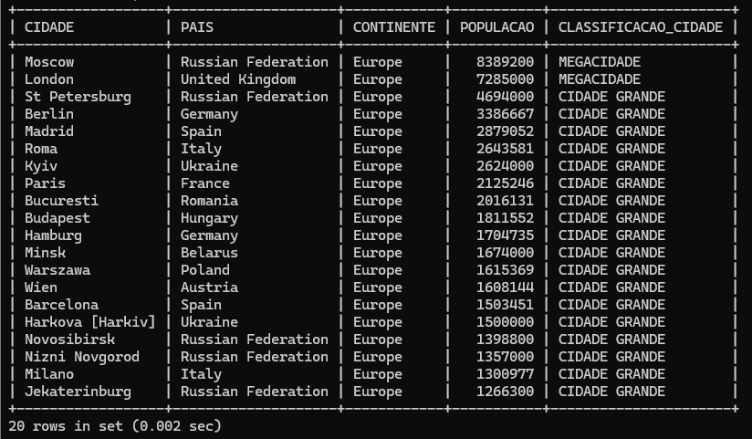

</td>

<td valign="top">

### [Query](case-when/exercicio-02/query.sql)

```sql
SELECT
    CI.NAME AS CIDADE,
    C.NAME AS PAIS,
    C.CONTINENT AS CONTINENTE,
    CI.POPULATION AS POPULACAO,
    CASE
        WHEN CI.POPULATION > 5000000
        THEN 'MEGACIDADE'

        WHEN CI.POPULATION >= 1000000
            AND CI.POPULATION <= 5000000
        THEN 'CIDADE GRANDE'

        WHEN CI.POPULATION >= 500000
            AND CI.POPULATION < 1000000
        THEN 'CIDADE MÉDIA'

        ELSE 'CIDADE PEQUENA'
    END AS CLASSIFICACAO_CIDADE
FROM CITY CI
INNER JOIN COUNTRY C
    ON CI.COUNTRYCODE = C.CODE
WHERE C.CONTINENT = 'EUROPE'
    AND CI.POPULATION > 100000
ORDER BY POPULACAO DESC
LIMIT 20;
```

</td>
</tr>
</table>

---

## Objetivo 3

Listar:

* continente
* quantidade de países distintos
* população total das cidades
* classificação do impacto urbano

Classificar o impacto urbano utilizando `CASE WHEN`, considerando:

* soma da população das cidades maior que 1000000000 → `IMPACTO URBANO MUITO ALTO`
* soma da população das cidades entre 500000000 e 1000000000 → `IMPACTO URBANO ALTO`
* soma da população das cidades entre 100000000 e 500000000 → `IMPACTO URBANO MÉDIO`
* soma da população das cidades menor que 100000000 → `IMPACTO URBANO BAIXO`

Considerar apenas cidades com população maior que 300000.

Agrupar os resultados por continente.

Ordenar da maior população total das cidades para a menor.

---

<table>
<tr>
<td valign="top">

### Resultado

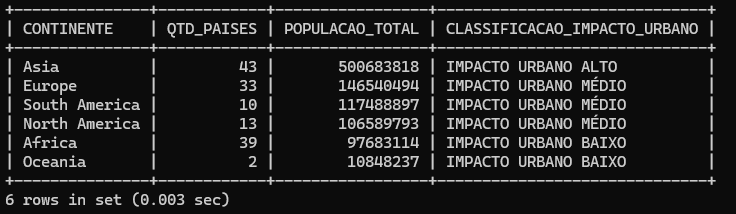

</td>

<td valign="top">

### [Query](case-when/exercicio-03/query.sql)

```sql
SELECT
    C.CONTINENT AS CONTINENTE,
    COUNT(DISTINCT C.CODE) AS QTD_PAISES,
    SUM(CI.POPULATION) AS POPULACAO_TOTAL,
    CASE
        WHEN SUM(CI.POPULATION) > 1000000000
        THEN 'IMPACTO URBANO MUITO ALTO'

        WHEN SUM(CI.POPULATION) >= 500000000
            AND SUM(CI.POPULATION) <= 1000000000
        THEN 'IMPACTO URBANO ALTO'

        WHEN SUM(CI.POPULATION) >= 100000000
            AND SUM(CI.POPULATION) < 500000000
        THEN 'IMPACTO URBANO MÉDIO'

        ELSE 'IMPACTO URBANO BAIXO'
    END AS CLASSIFICACAO_IMPACTO_URBANO
FROM COUNTRY C
INNER JOIN CITY CI
    ON C.CODE = CI.COUNTRYCODE
WHERE CI.POPULATION > 300000
GROUP BY C.CONTINENT
ORDER BY POPULACAO_TOTAL DESC;
```

</td>
</tr>
</table>

---

# EXISTS

## Objetivo 1

Listar:

* nome do país
* continente
* população do país

Exibir apenas países que possuem pelo menos uma cidade cadastrada com população maior que 8000000.

Retornar apenas os 10 países com maior população.

---

<table>
<tr>
<td valign="top">

### Resultado

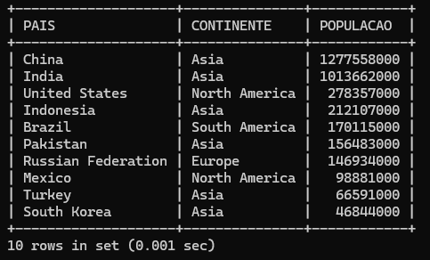

</td>

<td valign="top">

### [Query](exists/exercicio-01/query.sql)

```sql
SELECT
    C.NAME AS PAIS,
    C.CONTINENT AS CONTINENTE,
    C.POPULATION AS POPULACAO
FROM COUNTRY C
WHERE EXISTS (
    SELECT 1
    FROM CITY CI
    WHERE C.CODE = CI.COUNTRYCODE
        AND CI.POPULATION > 8000000
)
ORDER BY POPULACAO DESC
LIMIT 10;
```

</td>
</tr>
</table>

---
